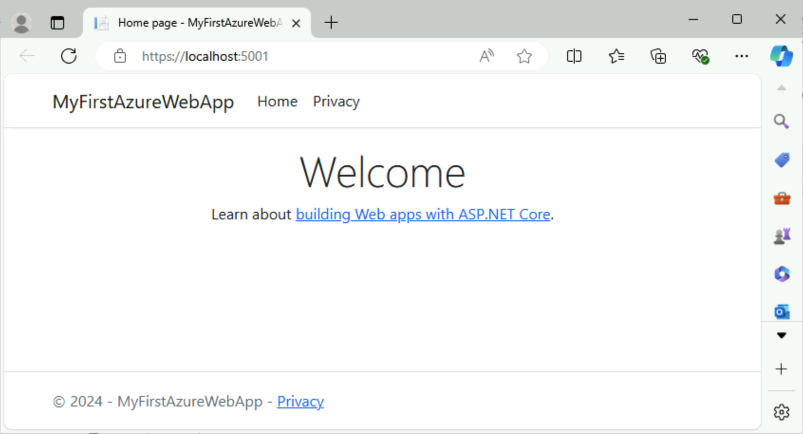

# Crear WebAPP con AppService

1. Ejecutar el siguiente comando para crear la app web

        dotnet new webapp -n MyFirstAzureWebApp --framework net8.0 cd MyFirstAzureWebApp
2. Validar que se se compila y ejecuta de manera correcta

        dotnet run 
3. Abrir la url en el navegador

## Publicar la WebApp en Azure App Service

1. Inciiar session en la cuenta de Azure

        az login
    
2. Ejecutar el siguiente comando para crear Azure AppService, grupo de recurso y publicar l Web App, tomara unos minutos, en la consola se mostrara el proceso cuando este listo ingresar al link para visualizar la app funcioando 

        az webapp up --sku F1 --name MyFirstAzureWebApp --os-type linux

Al terminar puedes abrir el siguiente link en el navegador (sustituye <app-name> por el nombre de tu app en este caso MyFirstAzureWebApp)`http://<app-name>.azurewebsites.net`

